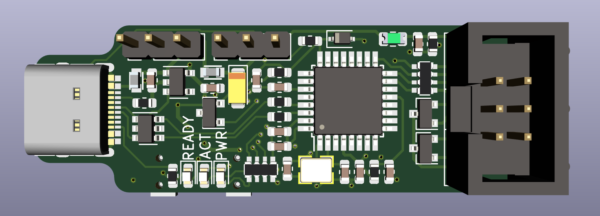

# AVRISP-MKII

AVRISP-MKII clone, in a small form factor with USB Type C connector. 

## BUGS
- HWB does not appear to put the board into DFU.
- To flash the board, RST on the ISP header needs to be connected to RST on the MCU, and disconnected after. 

